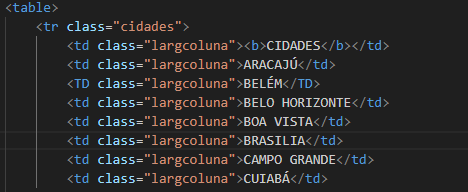
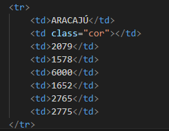
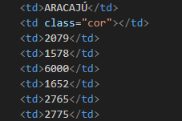
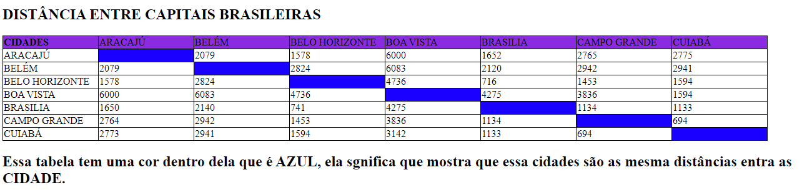

# Projeto - Distância capitais entre capitais brasileiras

Projeto criado como parte avaliativa da disciplina de desenvolvimento ministrada pelo professor Leonardo Rocha.

## Ínice

* [descrição](#descrição)
* [tecnologias](#tecnologias)
* [referências](#projeto---distância-capitais-entre-capitais-brasileiras)
* [autor(a)](#autora)

## Descrição
 O projeto consiste na composição de uma tabela que conta com capitais brasileiras e a distâncias entre essas capatais. As contantes 
 nesse projeto são:

 * ARACAJÚ
 * BELÉM 
 * BELO HORIZONTE
 * BOA VISTA
 * BRASILIA
 * CAMPO GRANDE 
 * CUÍABA

### Resultado do projeto

### Tabela

 * table - é um conjunto estruturado de dados composto de linhas e colunas (dados tabulares).
 * tr - a tag tr cria uma linha dentro de uma tag table e acomoda diversas tags th ou td que criam colunas dentro das linhas, formando uma tabela no documento
 * td - a tag td cria uma coluna para inserção de conteúdos, junto a diversas outras colunas em uma mesma linha definida pela tag tr
 
Veja uma imagem de parte do codígo, onde é possivel indentificar o uso dos elementos mencionados acima:

* table



* tr



* td





 ### Estilização

O projeito foi estilizado, utiliza CSS3. foi criado um arquivo chamando main css. nesse arquivo,
constam configurações de estilo apresentadas a seguir:

* Estilo de cores - A cor de fundo utilizada no projeto foi definida como segue:

```
.cidades{
    background-color: blueviolet;
    
}
```

## tecnologias

* HTML5
* REAME
* GIT
* GITHUB


## referências

[alura](https://www.alura.com.br/artigos/escrever-bom-readme)-como escrever um README increvel no seu github


## autor(a)

Projeto desenvolvido por:

* brenda 
* joão
* flora
* ana laura
* sabrina
* willian

